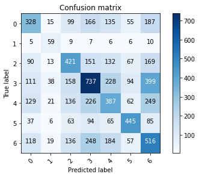
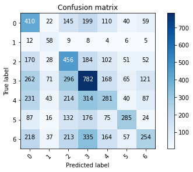
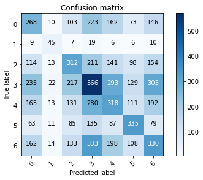
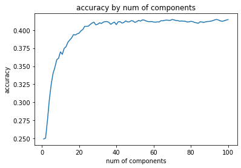

# PCA_Model
Implementation of a **PCA** model to reduce the **compression rate** of images.

Later in the project a **KNN** model was applied to both the initial data, and the dimension reduced data after PCA. **CCR** and **confusion matrices** were compared for both models.

<h4> &nbsp;Step 1:</h4>

First, I read the data into **pandas dataframe** and seperate the training set.

<h4> &nbsp;Step 2:</h4>

Then I calculate the mean of each column (feature), and subtract it from the dataset so that the dataset is **centered on the origin**.

Moreover, I calculate the **covariance matrix** of the mean-centered data, and compute the **eigenvalues** and **eigenvectors** for the calculated matrix, using NumPy as below:

```ruby
cov = np.cov(images_mean_centered, rowvar = False)
eigenvalues, eigenvectors = np.linalg.eig(cov)
```

Finally I sort the eigenvalues in the descending order along with their corresponding eigenvector.

<h4> &nbsp;Step 3:</h4>

For choosing the number of principle components, I use **cumulative variance ratio**, and by evaluating it I can preserve the information of original data. The choice of k is done by selection of the smallest values of k, which has a variance ratio higher than a **specific threshold**, 99% for example.

I choose the first 4 eigenvalues in the descending order and their corresponding eigenvector.

The eigenvectors and eigenvalues of a covariance matrix represent the **“core” of a PCA**: The eigenvectors (principal components) determine the directions of the new feature space, and the eigenvalues determine their magnitude. In other words, the eigenvalues explain the **variance** of the data along the **new feature axis**. Since the dataset in this question is images, the corresponding eigenvectors are also in the format of images.

<h4> &nbsp;Step 4:</h4>

Now I implemenet the **KNN** algorithm on the dataset, using sklearn library as below:

```ruby
knn = KNeighborsClassifier(n_neighbors=1)
```

First I normalize the data using **np.linalg.norm**. Then I implemenet the same algorithm for the reduced data.

Then I define a confusion matrix from **sklearn.metrics**. The results are shown below:

<h4> &nbsp;Confusion Matrix for k = 1 without PCA:</h4>



<h4> &nbsp;Confusion Matrix for k = 2 without PCA:</h4>



<h4> &nbsp;Confusion Matrix for k = 1 with PCA:</h4>



<h4> &nbsp;Confusion Matrix for k = 1 with PCA:</h4>


Computing **CCR** for each of the above methods:

CCR for k = 1, initial data: 0.40303705767623293

CCR for k = 2, initial data: 0.3519086096405684

CCR for k = 1, reduced data: 0.3028698801894678

CCR for k = 2, reduced data: 0.3028698801894678

As it can be seen from the above results, when we use the initial data, the program takes so much to run, but according to the confusion matrix and the accuracy score, the results are more accurate. However, when using pca, the program becomes much faster, but the accuracy is a little bit lower.

In the final step of this project, I implemented PCA with **different number of components**, and tested the accuracy of the different KNN models, using sklearn:

```ruby
from sklearn.metrics import accuracy_score
```

The result is as follows:


